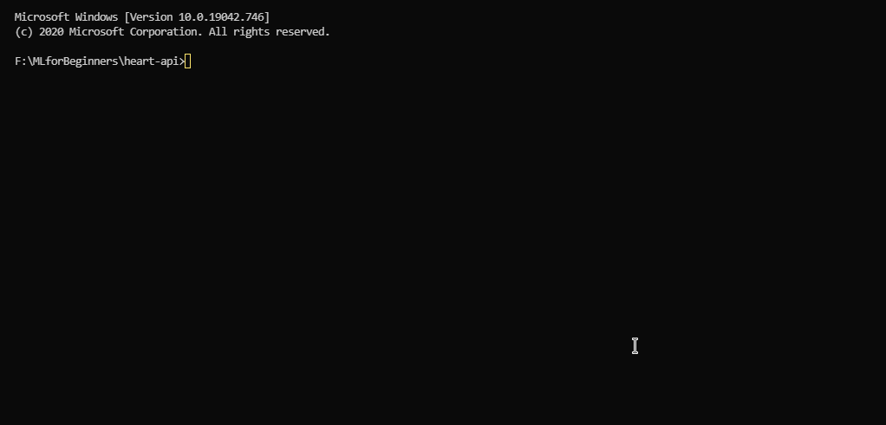

# Heart Attack Prediction - API

## Step 0
* Install [Python](https://www.python.org/downloads/).
* install `virtualenv` for creating isolated virtual python environments. [[source]](https://pypi.org/project/virtualenv/)
```
pip install virtualenv
```



## Step 1

Open up windows powershell as Administrator, navigate to `your\path\to\heart-api
```
cd your\path\to\flask-api-boilerplate
```
## Step 2

Execute command `virtualenv --python=python3.7 env` to create a python virtual environment and wait until it is created.

Execute command `.\env\Scripts\activate` to activate virtual environment.

*Note: if Powershell gives you an error as `“execution of scripts is disabled on this system.”`, run this command first*
```
Set-ExecutionPolicy RemoteSigned
```

Execute command `pip install -r .\requirements.txt` to install requirements

## Step 3

Execute `flask run` to start application. (or executing  `python .\app.py` should also work)

*Note: While doing this if you run into an error like `"Error: Could not locate flask application. You did not provide the FLASK_APP environment variable"`, execute this command first*
```
$env:FLASK_APP = "run.py"
```

## Step 4 (Test POST Method)

Open up [postman](https://chrome.google.com/webstore/detail/tabbed-postman-rest-clien/coohjcphdfgbiolnekdpbcijmhambjff?hl=en) and send `POST` request to `http://127.0.0.1:5000/predict` with `Json` body as,

```
{
  "age": "57",
  "sex": "Male",
  "cp": "1",
  "trestbps": "130.0",
  "chol": "236.0",
  "fbs": "0.0",
  "restecg": "0",
  "thalach": "174.0",
  "exang": "0.0",
  "oldpeak": "0.0",
  "slope": "1.0",
  "ca": "1.0",
  "thal": "2.0"
}
```
If everyting is configured properly, you should get a `200` responce as,
```
{
    "prediction": "1.0",
}
```
## Step 5 (Deploy)

Create an account on [Heroku](https://signup.heroku.com/login), download and install [Heroku CLI](https://devcenter.heroku.com/articles/heroku-cli)

Execute command `heroku login` and enter credentials to login to Hiroku CLI.

Execute command `heroku create your-app-name` to create a new application. (https://your-app-name.hirokuapp.com will be your URL)

## Step 6 (Deploy cont.)


Now execute following commands one after the other. (change `your-app-name` in line 2 to the name you have given in the previous step)
```
git init
heroku git:remote -a your-app-name
git add .
git commit -m "initial commit"
git push heroku master
```
Last command will push your code to heroku platform and start deploying. Hereafter whenever you want to create a new build, just execute last 3 commands only, i.e.
```
git add .
git commit -m "initial commit"
git push heroku master
```

Optional command `heroku logs --tail` to view realtime logs of the deployement server.

## Next Steps
* [Deploy Machine Learning Model using Flask](https://www.youtube.com/watch?v=UbCWoMf80PY)
* [Deployment of NLP Model in Heroku Cloud](https://www.youtube.com/watch?v=1umQhC2iWdY)
